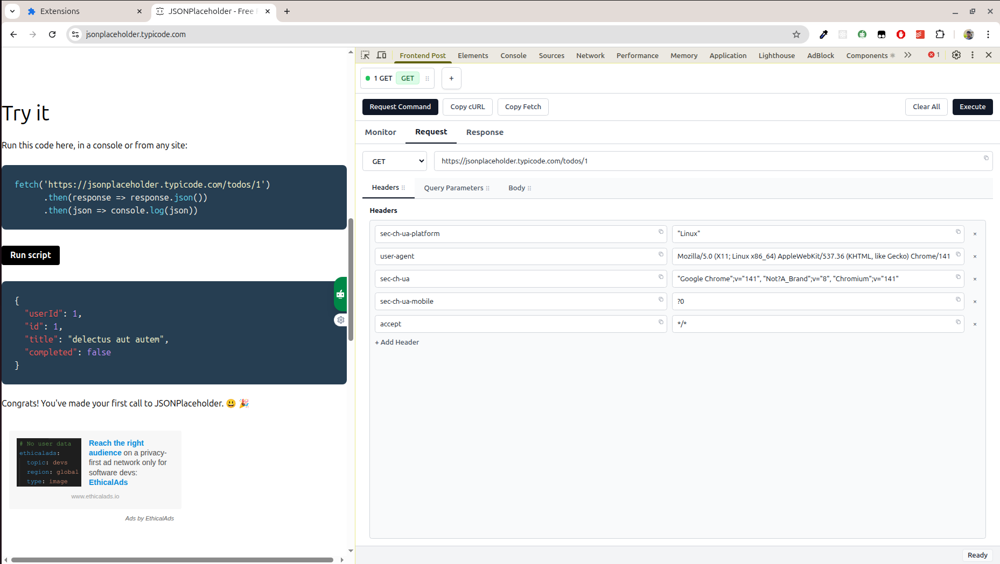
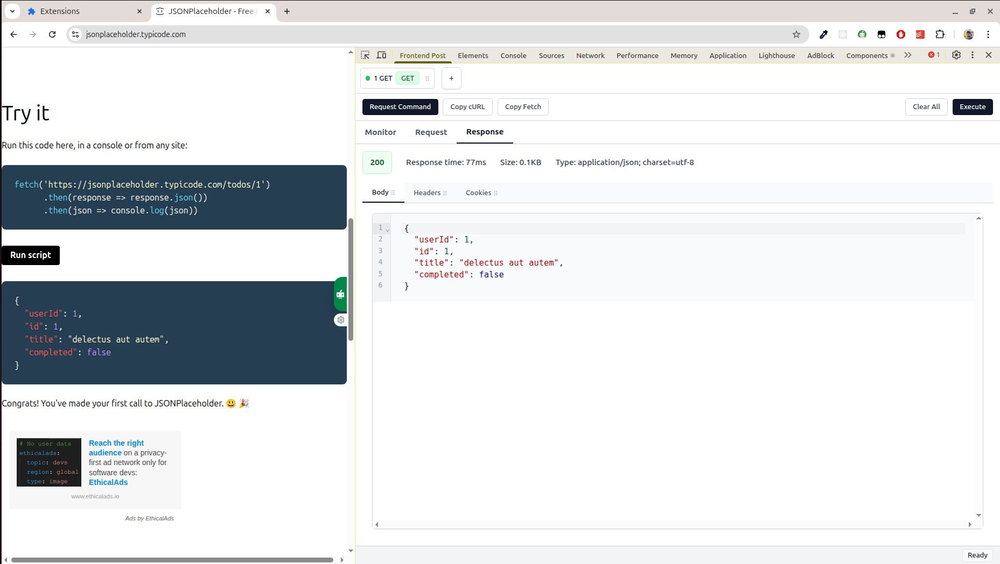
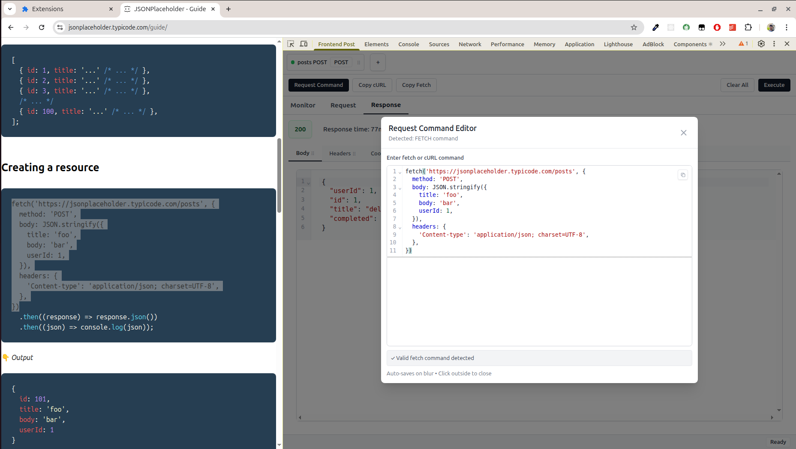
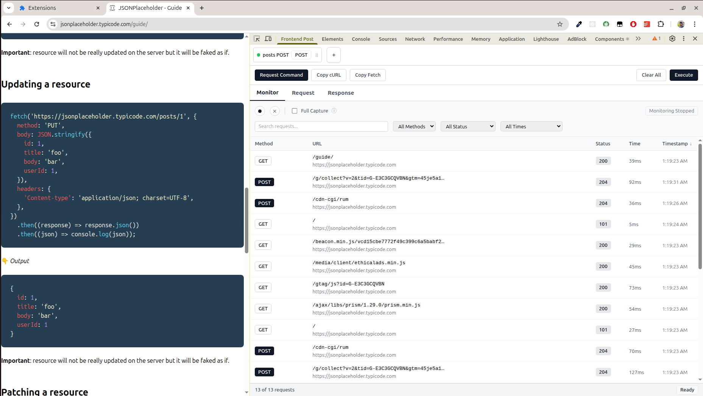

<div align="center">

# Frontend Post

**HTTP Request Testing & Network Monitoring for Chrome DevTools**


A production-ready Chrome DevTools extension for HTTP API testing, network monitoring, and request debugging with CORS bypass capabilities.

</div>

## Screenshots

### Request Builder Interface

*Build HTTP requests with an intuitive tabbed interface - headers, query parameters, and body editor with syntax highlighting*

### Response Viewer

*View formatted responses with organized tabs for body, headers, and cookies*

### Import/Export Commands

*Import cURL and fetch commands with smart parsing - CodeMirror integration for professional editing*

### Network Monitor

*Real-time network monitoring with sortable columns and advanced filtering*


---

## Overview

Frontend Post is a Chrome DevTools extension designed for developers who need comprehensive HTTP request testing and network monitoring capabilities. Built with modern web technologies and Chrome Extension APIs, it provides CORS-free request execution, real-time network monitoring, and advanced debugging features.

### Key Capabilities

- **CORS Bypass**: Execute requests with Chrome Extension privileges, bypassing same-origin policy restrictions
- **Network Monitoring**: Real-time capture and inspection of HTTP traffic with optional response body capture via Chrome Debugger API
- **Request Management**: Multi-tab interface with persistent storage and drag-and-drop organization
- **Import/Export**: Parse and convert cURL and fetch() commands with intelligent header and body extraction
- **Developer Tools Integration**: Seamless integration with Chrome DevTools for streamlined workflow

---

## Features

### Core Functionality

#### Request Builder
- Multi-tab interface for concurrent request management
- Automatic URL parsing with query parameter extraction
- HTTP method support: GET, POST, PUT, DELETE, PATCH, HEAD, OPTIONS
- CodeMirror-based body editor with syntax highlighting
- JSON/HTML/XML auto-formatting capabilities
- Header and query parameter management

#### Response Viewer
- Organized tabbed interface (Body, Headers, Cookies)
- Syntax highlighting for JSON, HTML, and XML responses
- Response timing and performance metrics
- HTTP status indicators with visual feedback
- One-click copy functionality for response data
- Complete cookie information display with flags and expiration

#### Network Monitoring
- Real-time HTTP traffic capture and inspection
- Sortable table view (Method, URL, Status, Duration)
- Advanced filtering: search, method, status code, time range
- Single-click request population into editor
- Double-click to create new tab with request/response pair
- Auto-monitoring on DevTools initialization
- Optional Chrome Debugger API integration for full response body capture

#### Import/Export
- cURL command parsing and import
- fetch() API command conversion
- Intelligent header, body, and query parameter extraction
- Export requests as cURL commands
- Export requests as JavaScript fetch() code

#### Tab Management
- Persistent tab storage across browser sessions
- Drag-and-drop tab reordering
- Per-tab request/response isolation
- Automatic endpoint-based naming
- Minimum one-tab enforcement

#### Developer Experience
- Dedicated CodeMirror editor for command input
- Automatic per-tab data persistence
- Form reset functionality
- Toast notification system
- Comprehensive error handling and user feedback

---

## Architecture

Frontend Post implements a production-grade architecture leveraging Chrome Extension APIs and modern React patterns.

### State Management

The application uses React's `useReducer` pattern for centralized state management:

- **9 Action Types**: LOAD_TABS, CREATE_TAB, CLOSE_TAB, SWITCH_TAB, UPDATE_TAB, UPDATE_REQUEST, UPDATE_RESPONSE, REORDER_TABS, CLEAR_REQUEST
- **Immutable Updates**: Guaranteed object references ensure reliable React re-renders
- **Predictable Flow**: All state mutations go through reducer functions
- **Debugging**: Action types provide clear audit trail of state changes

### Chrome Extension Integration

#### Background Service Worker
- Executes HTTP requests with Chrome Extension privileges
- Bypasses CORS restrictions via `<all_urls>` host permissions
- Manages Chrome Debugger API for optional full response body capture
- Implements Chrome webRequest API for standard network monitoring
- Handles Chrome Cookies API for HttpOnly cookie access

#### Communication Layer
```
DevTools Panel (React)
    ↓ Chrome Runtime Port
Background Script (Service Worker)
    ↓ Chrome APIs (fetch, debugger, webRequest)
Network Requests (CORS-free)
    ↓ Response Data
DevTools Panel (Display)
```

#### Data Persistence
- **Chrome Storage API**: Tab data persistence across browser sessions
- **localStorage**: User preferences and UI state
- **Auto-save**: Debounced saves with data loss prevention
- **Schema Migration**: Version-aware storage updates

### Technical Stack

#### Frontend
- React 18 with concurrent rendering features
- TypeScript for complete type safety
- Tailwind CSS utility-first styling
- CodeMirror 6 for code editing
- Vite build tooling with HMR

#### Chrome Extension
- Manifest V3 specification
- Service Worker background architecture
- DevTools API integration
- Debugger API for network inspection
- Storage API for data persistence

#### Development
- Turborepo monorepo management
- ESLint for code quality
- Prettier for code formatting
- TypeScript strict mode

### Project Structure

```
frontend-post/
├── chrome-extension/          # Extension core
│   ├── src/background/        # Service worker & HTTP engine
│   ├── public/                # Icons, new tab page
│   └── manifest.ts            # Extension configuration
│
├── pages/
│   ├── devtools/              # DevTools entry point
│   ├── devtools-panel/        # Main application
│   │   ├── src/
│   │   │   ├── components/    # React components
│   │   │   ├── hooks/         # Custom hooks (useTabs)
│   │   │   ├── utils/         # Utilities & parsers
│   │   │   └── types/         # TypeScript definitions
│   │   └── index.html
│   └── new-tab/               # Custom new tab page
│
└── packages/                  # Shared utilities
    ├── storage/               # Storage helpers
    ├── hmr/                   # Hot module reload
    └── shared/                # Common code
```

### Design Patterns

1. **Reducer Pattern**: Centralized state management with action-based mutations
2. **Component Composition**: Modular, reusable React components
3. **Custom Hooks**: Encapsulated business logic (useTabs, useMonitoring)
4. **Port Communication**: Real-time Chrome extension messaging
5. **Error Boundaries**: Graceful error handling and recovery
6. **Code Splitting**: Optimized bundle sizes with lazy loading

---

## Installation

```bash
# 1. Clone the repository
git clone <your-repo-url>

# 2. Install pnpm globally (if not already installed)
npm install -g pnpm

# 3. Install dependencies
pnpm install

# 4. Build for development
pnpm dev

# 5. Build for production
pnpm build
```

### Load Extension

1. Navigate to `chrome://extensions` in Chrome
2. Enable Developer mode (toggle in top-right corner)
3. Click "Load unpacked"
4. Select the `dist` directory from the project root

### Access DevTools Panel

1. Open Chrome DevTools (F12 or Right-click → Inspect)
2. Navigate to the "Frontend Post" tab
3. Begin testing HTTP requests

---

## Usage

### Basic Request Execution

```bash
# 1. Enter target URL
https://api.github.com/users/octocat

# 2. Select HTTP method
GET

# 3. Execute request
# View formatted response with timing metrics
```

### Import cURL Commands

```bash
# Paste cURL command in Request Command modal
curl -X POST https://api.example.com/data \
  -H "Content-Type: application/json" \
  -d '{"key":"value"}'

# Automatically populates request builder
```

### Network Monitoring

1. Navigate to Monitor tab
2. Network requests are captured in real-time
3. Click request to populate editor
4. Double-click to create new tab with request/response pair
5. Enable "Full Capture" for complete response bodies (requires Chrome Debugger API)

### Tab Management

- Tabs persist across browser sessions via Chrome Storage API
- Drag-and-drop to reorder tabs
- Each tab maintains independent request/response state
- Auto-save prevents data loss

---

## API Reference

### State Management

```typescript
// Reducer action types
type TabAction =
  | { type: 'LOAD_TABS'; payload: Tab[] }
  | { type: 'CREATE_TAB'; payload: { name: string; request?: Partial<HttpRequest> } }
  | { type: 'UPDATE_REQUEST'; payload: { tabId: string; request: Partial<HttpRequest> } }
  | { type: 'UPDATE_RESPONSE'; payload: { tabId: string; response: HttpResponse | null } }
  // ... additional action types
```

### Chrome Extension Communication

```typescript
// DevTools → Background Script
interface FetchRequest {
  type: 'EXECUTE_FETCH';
  requestId: string;
  url: string;
  options: RequestInit;
}

// Background Script → DevTools
interface FetchResponse {
  type: 'FETCH_RESULT';
  requestId: string;
  result: HttpResponse;
}
```

### Command Parsing

```typescript
// cURL and fetch() command parsing
parseCurlCommand(command: string): HttpRequest
parseFetchCommand(command: string): HttpRequest
```

---

## Contributing

Contributions are welcome. The project uses:

- React 18 with TypeScript
- Chrome Extension Manifest V3
- Vite build system with Turborepo
- Tailwind CSS for styling
- CodeMirror 6 for code editing

Please ensure all contributions include:
- TypeScript type definitions
- ESLint compliance
- Appropriate test coverage
- Documentation updates

---

## License

MIT License

---

## Technical Advantages

### CORS Bypass
Chrome Extension privileges enable unrestricted cross-origin requests, eliminating CORS limitations that affect browser-based tools.

### Network Monitoring
Real-time traffic capture with optional Chrome Debugger API integration provides complete request/response visibility including response bodies.

### Data Persistence
Chrome Storage API ensures tab data survives browser restarts, while localStorage maintains user preferences and UI state.

### Developer Integration
Seamless Chrome DevTools integration provides familiar workflow without context switching.

### Type Safety
Complete TypeScript coverage ensures compile-time error detection and improved maintainability.

---

<div align="center">

**Production-Ready HTTP Testing for Chrome DevTools**

[Report Issues](https://github.com/your-repo/issues) · [Request Features](https://github.com/your-repo/issues) · [Documentation](https://github.com/your-repo/wiki)

</div>
